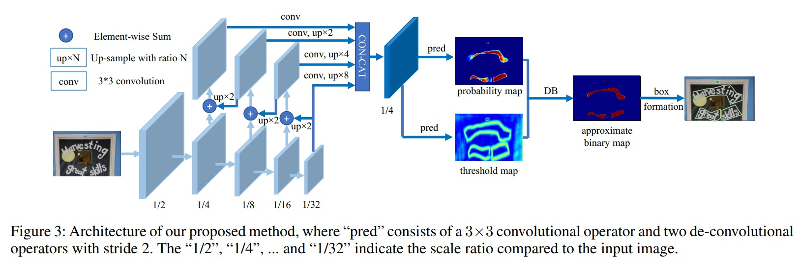

# Real-time Scene Text Detection with Differentiable Binarization

**note**: some code is inherited from [MhLiao/DB](https://github.com/MhLiao/DB)

[中文解读](https://zhuanlan.zhihu.com/p/94677957)

为了降低传输时间，训练集和模型文件都删了，需要自己重新跑
1.在官网下载训练集以及测试集,下载解压后将训练集和测试集文件拷贝至DBNet.pytorch/datasets文件夹中，得到下列文件.
2.利用基于ichar2015.yaml的icdar2015_resnet18_FPN_DBhead_polyLR.yaml模型，所以需要将数据处理成ICDAR2015格式，
DBNet.pytorch/README.md文件中有说明数据格式。此时需要把数据处理成josn格式。 我们将原始训练集分为训练集和验证集，
使用留出法划分为验证集：训练集 = 1：9。运作处理脚本data_process.py
3.安装所需库requirement.txt
4.修改icdar2015_resnet18_FPN_DBhead_polyLR.yaml配置文件，修改resume_checkpoint和finetune_checkpoint地址进行中途保存
使用终端指令进行模型训练，在根目录下使用python tools/train.py --config_file "config/icdar2015_resnet18_FPN_DBhead_polyLR.yaml"
5.将测试模型放入test文件夹下的input中，会新生成一个output文件夹存放产生的txt文件。
6.模型测试，终端下使用python tools/eval.py --model_path '（训练出来的模型的位置）'查看位置
7.检测完模型测试后，将模型放入根目录中，使用python tools/predict.py进行模型训练，生成txt文件